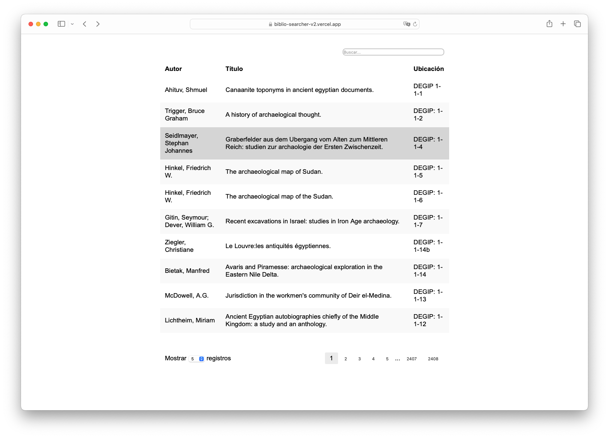

  

## Justificación / [Rationale](README.md)

* [Aplicación web](https://biblio-searcher-v2.vercel.app/) que incluye un buscador de la base de datos de nuestra biblioteca y está abierta a todo el mundo
* Los objetivos propuestos y alcanzados han sido el minimalismo en su diseño, la coherencia con [otras herramientas que aparecerán próximamente](https://github.com/imhicihu/IMHICIHU-Biblioteca), la escalabilidad a lo largo del tiempo y la rapidez de respuesta
* Este repositorio es un documento vivo que crecerá y se adaptará con el tiempo
  

### Pruebas
* Probado y validado en estos navegadores web:

| Navegador | validado |
|:--|:--|
| Internet Explorer | ✓ |
| Microsoft Edge | ✓ |
| Firefox Developer Edition | ✓ |
| Apple Safari | ✓ |
| Apple Safari Technology Preview | ✓ |
| Opera | ✓ |
| Brave | ✓ |
| Google Chrome | ✓ |

### ¿Con quién puedo contactar?
* Propietario o administrador del repositorio
    - Ponte en contacto con `imhicihu` en `gmail` punto `com`

### Descargo de responsabilidad
* Este repositorio tiene fines exclusivamente académicos. Está destinado a usos educativos y de investigación, y no debe utilizarse con fines comerciales

### Código de conducta
* Por favor, consulta nuestro [Código de conducta](code_of_conduct.md)

### Aspectos legales
* Todas las marcas registradas son propiedad de sus respectivos titulares

### Licencia
* El contenido de este proyecto está bajo una 
