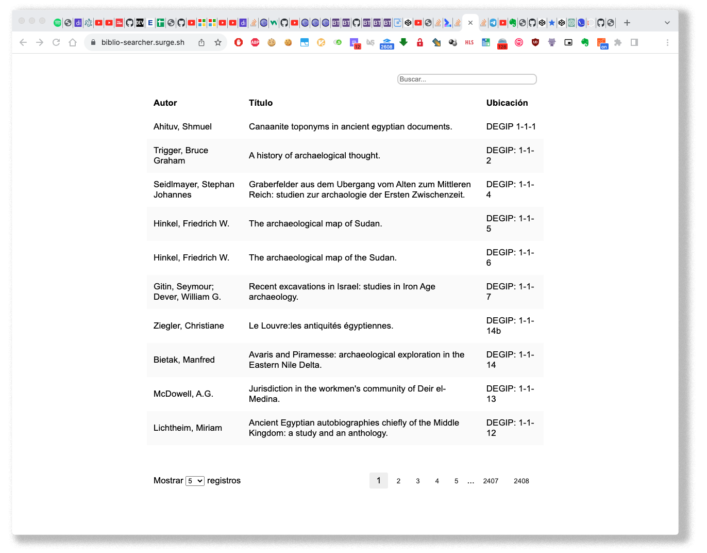

  

# RATIONALE

* [Website](https://biblio-searcher-v2.vercel.app/) that involves a database searcher of our library and open to everyone
* The goals proposed and achieved have been minimalism in its design, consistency with [other tools soon to appear](https://github.com/imhicihu/IMHICIHU-Biblioteca), scalability across time and speed of response
* This repo is a living document that will grow and adapt over time
  

### Tests
* Tested & validated in these web browsers:

| Browser | validate |
|:--|:--|
| Internet Explorer | ✓ |
| Microsoft Edge | ✓ |
| Firefox Developer edition| ✓ |
| Apple Safari | ✓ |
| Apple Safari Technology Preview| ✓ |
| Opera | ✓ |
| Brave | ✓ |
| Google Chrome | ✓ |
   
### Who do I talk to?
* Repo owner or admin
    - Contact `imhicihu` at `gmail` dot `com`

### Disclaimer
* This repository is for academic purposes only. It is intended for educational and research use, and should not be used for any commercial purposes

### Code of Conduct
* Please, check our [Code of Conduct](code_of_conduct.md)

### Privacy policy & Legal issues
* We do not collect any kind of data: no cookies, no advertising platform, no analytics tools 
* All trademarks are the property of their respective owners

### License
* The content of this project itself is licensed under the 
